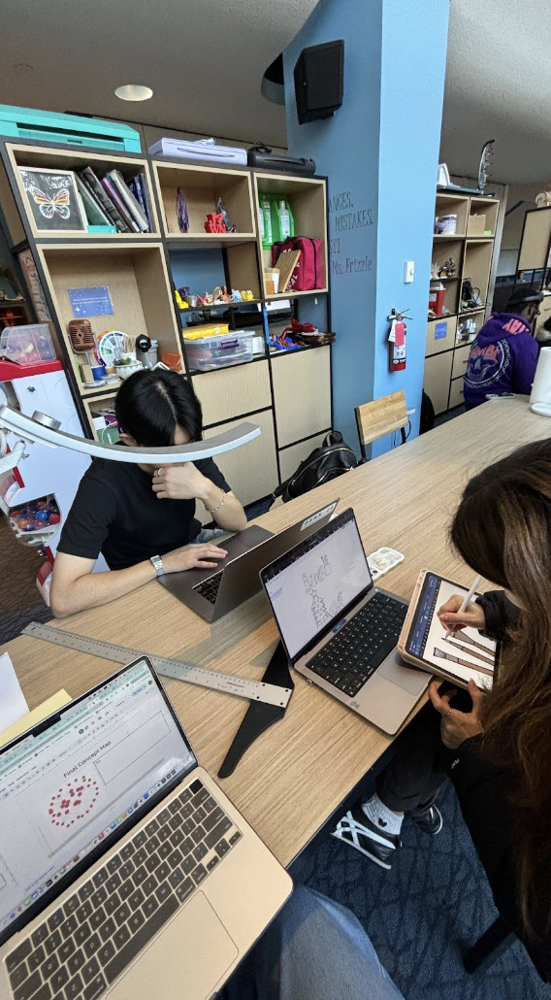

My group was assigned the theme of textiles and textures, and on day one, we immediately began brainstorming ideas. First, we discussed several concepts (Photo 1). After reviewing the provided examples, we found significant inspiration in a nodal model. Additionally, after hearing about each group member’s multimedia project, we realized that many of us had written about activities featured in The Umpire. This discovery inspired us to combine our past work with the nodal model to create our project. We drafted phrases and activities that were present in The Umpire based on our individual projects (Photo 2). To identify additional activities, we revisited the Umpire spreadsheet and examined the tags.

Photo 1: Brainstorming Ideas 

Photo 2: List of activities 

After refining our idea, we designed a nodal diagram connecting words and activities in The Umpire. Our goal was to explore word correlations which are how close one word or phrase is to another in the text. By doing this, we can see if there is a relationship between the words. A secondary goal was to include an interactive element, particularly one involving touch since our focus was on textures. We divided the work, and the guided roles helped us meet our objectives efficiently. Each group member contributed based on their strengths. For instance, our digital asset manager began coding and creating a rough draft of the diagram. Our design facilitator then refined the draft into a cleaner, more readable version, and finally, our fabricator printed and stitched the design. And I ensured everything was flowing smoothly.

One of our successes was adhering strictly to our timeline and being very organized. After a Zoom meeting outside of class, I set a deadline for drafts to be completed by the following Saturday, with votes due by Sunday. We had numerous different drafts and we all collaborated on them. The first coded diagrams were fairly messy but we all chose the major concepts we thought were the most important to include. Then, on Monday, we planned to thread and print in the Education Commons. One set back was that the sewing machine was being used by another group which delayed our process. However, the additional time allowed us to make the final design more visually appealing. Everyone completed their assigned tasks punctually which led to an overall smooth process.

However, I feel our creativity with regard to texture fell slightly short. While our overall concept was strong, the physical design could have been better. One issue was that we didn’t have drafts of a visual representation on our first day, largely because it involved coding and required more time. Because of this, we could not discuss the design in person which could have been helpful. Despite this, we worked through multiple drafts and gave the design a lot of thought. Another limitation was our initial decision to create black-and-white designs for the activities because we thought the technology was only limited to black-and-white (Photo 3). Thankfully, while working in the Education Commons, we discovered we could add color, which improved the final product (Photo 4). In retrospect, incorporating different textures for the activities might have added more variety and depth to the project. We could have explored different materials on the first day to get an understanding of what was possible. 

Photo 3: Original black and white design 

Photo 4: Colored designs

As the project manager, my role was to ensure the project ran smoothly, which involved staying flexible, fulfilling various roles as needed, and keeping everyone on task. First, I collected everyone’s phone numbers and created a group chat. I scheduled a meeting outside of class and held group members accountable for their contributions. For example, since the only time we could meet as a group was at 9 p.m., and some members lived off-campus, we moved the originally planned in-person meeting to Zoom. During the meeting, I shared my screen and guided the discussion by asking questions to keep the group focused. Through this role, I developed problem-solving skills and gained leadership experience.

I also stepped into different roles when necessary. For example, when our documentarian was unable to attend the final project day, I took photos of the process. Additionally, I assisted as the outreach specialist by helping plan and create the slideshow. Lastly, I stepped in as the digital asset manager on Monday to ensure all of the words on our diagram were matched correctly. I referred to the original diagrams with the messy lines and made sure each individual connection was correct. Later, we added some connecting lines that we had previously forgotten (Photo 5). 

Photo 5: Printing Day in the Education Commons

Overall, I believe our group dynamic worked well and we did an excellent job of staying on track. However, because a few of our group members were not in person on Monday, November 25th, it did leave more work on the people that were in person. Moreover, one of our group members could not make it to the Zoom meeting last minute which is when most of the planning occurred. If all members were present every day I think the project would have moved along a little quicker. Thankfully, everyone was fairly active on text messaging so we could reach the other members when we needed input. 
