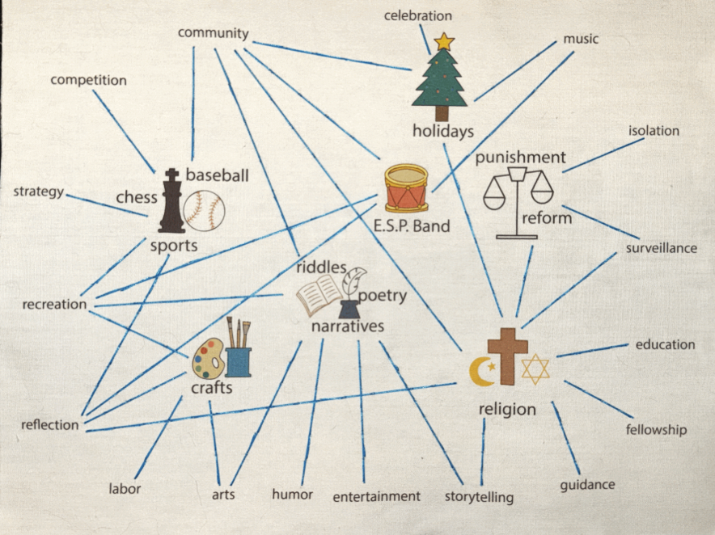
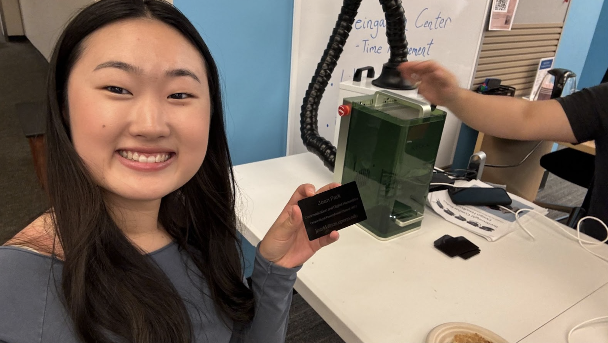
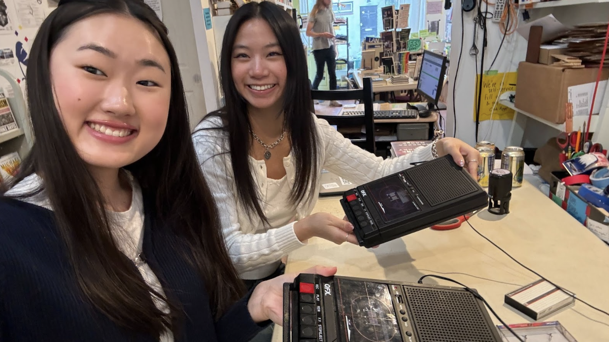
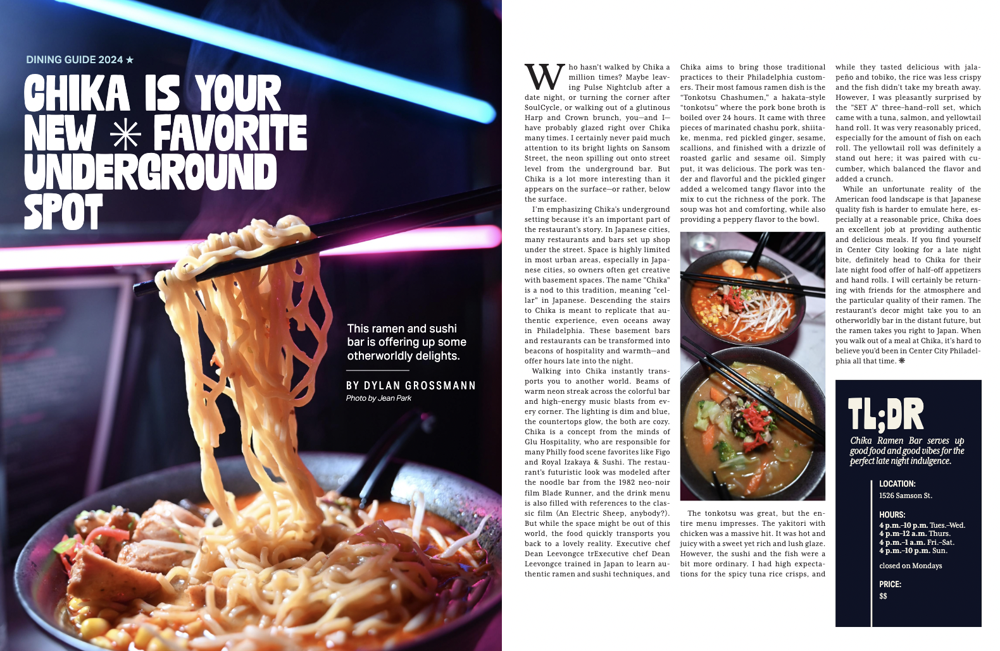
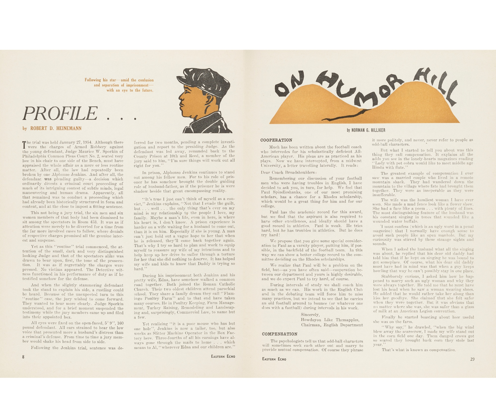

# Jean Park's Digital Humanities Portfolio

## Humanizing Data as a Central Theme
One of the most significant themes that emerged in this course was the importance of humanizing data. Numbers and graphs are often seen as impersonal, stripped of context and narrative. However, this course emphasized the need to look beyond raw data to uncover the human stories they represent. For instance, in our EC group project, my group chose to explore activities at Eastern State. I particularly appreciated that we included textiles and textures, allowing the class to physically feel and connect with the information. This tactile experience brought a deeper, more personal engagement with the material.

Final result from the EC group project. 

This idea ties closely to one of our readings, Kim Christen’s “Press Pause: Slowing Down Digital Humanities Practice.” In it, Christen advocates for a more intentional and reflective approach to digital humanities, emphasizing the importance of considering cultural contexts and ethical concerns, particularly in relation to Indigenous knowledge and communities. Through our classwork, we applied this perspective by highlighting the often-overlooked stories of incarcerated people, aiming to understand their experiences in fuller detail. This approach was similarly evident in the Printing in Prisons <a href="https://printinginprisons.org/blog/parkj/">project</a>, where we each focused on a specific aspect of Eastern State’s magazines and newspapers. I chose to examine the machines used for printing and the skill and labor required to operate them, which gave me a deeper appreciation for the human effort behind these processes.

Another article we explored, “Racism in the Machine: Visualization Ethics in Digital Humanities Projects,” underscored the need for inclusive collaboration with diverse stakeholders to minimize harm and prevent digital tools from reinforcing systemic inequalities. Working on group projects throughout the course, particularly the final group project, provided an opportunity to engage with classmates from different backgrounds. This diversity enriched my understanding and broadened my perspective, reinforcing the value of collaborative and inclusive practices in digital humanities.
 
## External Workshops & Connections
The external workshops I attended—one on laser engraving at Penn and another on cassette tape-making in Philadelphia—were not exactly related to the idea of humanizing data. However, upon reflection, I found a deep connection between the two: both workshops revolved around preserving information in tangible, enduring ways. Whether through laser engraving or recording audio on cassette tapes, both practices underscored the fragility of memory and the creative methods we use to safeguard it. 

In my last reflection, I wrote, “Both cassette tape recording and laser engraving center on the preservation of time and information in unique ways. And moreover, both can be lost or destroyed very easily.” This realization complemented our in-class discussions about digital preservation and the vulnerabilities of digital and physical records. While the workshops didn’t directly relate to data analysis, they reinforced the broader idea that preserving and contextualizing information—whether in data, objects, or narratives—is a deeply human concern. 

Moreover, putting all of our projects onto GitHub is a way of preservation similar to the workshops I went to. After this class ends, I can look at two physical artifacts and one digital collection of all of the work I did this semester. 

Photo from my workshop on Penn's campus at the Van Pelt Library. 

Photo from my workshop in Philadelphia at Iffy Books.

## Expectations vs. Reality of Digital Humanities
Coming into this class, I expected a more technical focus, similar to my experience in Data Science for the Humanities, where I learned coding skills to process and analyze datasets. However, this course shifted my perspective, emphasizing the “humanities” in digital humanities. Instead of focusing on the technical acquisition of data, we concentrated on interpreting and contextualizing it—a more reflective and analytical approach. This shift was unexpected but refreshing, allowing me to explore the humanistic side of the field. It reaffirmed my interest in studying people and communication, which aligns closely with my major.

## Discoveries and Affirmations
This class affirmed my passion for storytelling and my preference for the humanistic aspects of digital humanities over the technical ones. One exciting discovery was how my role as 34th Street Magazine’s Photo Editor informed my approach to assignments. For example, in the Printing in Prisons project, I chose to focus on color and the printing process, drawing on my experience with our magazine’s transition to a glossy monthly format. The photo below is two pages of the October issue that I took photos for and helped layout. The second photo below is from the Eastern Echo. Both of these magazines relied on the same method which was a single gathering of bifolium stapled in the middle. Thus each sheet was folded to create two leaves of the magazine. This connection between my academic and extracurricular interests was deeply satisfying and reinforced my commitment to integrating my personal experiences into my academic work.

 

## Strengths and Areas for Improvement
I believe I excelled in making the assignments personal and meaningful. By drawing on my background in communication, social media, and visual storytelling, I was able to create projects that felt authentic and relevant to me. However, I wish I had taken more risks in exploring unfamiliar tools or methods. For example, diving deeper into digital tools for visualization or experimenting with coding could have added another layer of depth to my work. If I could revise my projects, I would push myself to balance personal relevance with technical experimentation, broadening my skillset while maintaining my unique perspective.

## Projects

Link to Education Commons group project [reflection](ECReflection.md).

Link to looking forward [reflection](lookingforward.md).
